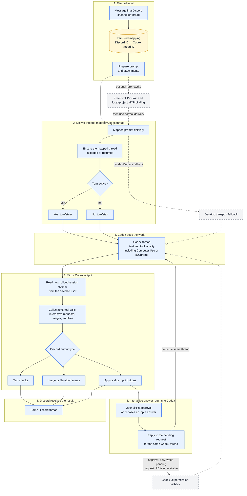

# Architecture Route Map

This page is the shortest path through the repository. It shows how one message
moves from Discord into the mapped Codex thread and how the result returns.
The Python files stay small on purpose: each one owns one part of the trip.

## Legend

- A solid arrow is the normal mapped-thread route.
- A dotted arrow is an optional path or a fallback.
- The persisted mapping is the transfer ticket between one Discord thread and
  one Codex thread.
- The mirror cursor is a bookmark in the Codex session log. It lets the next
  scan continue after the last delivered event instead of sending it again.

## End-to-end route



`Ensure the mapped thread is loaded or resumed` is deliberately broader than
`thread/resume`. The transport can reuse an already loaded subscription; it
does not need to send a new resume request for every Discord message.

## Source anchors

| Route stop | Responsibility | Start with |
| --- | --- | --- |
| Persisted mapping | Store and look up the Discord-to-Codex thread relationship | [`codex_discord_store_mirror_threads.py`](../codex_discord_store_mirror_threads.py), [`codex_discord_session_mirror.py`](../codex_discord_session_mirror.py) |
| Prompt preparation | Resolve the target and build the prompt/attachment delivery | [`codex_discord_prompt_delivery_prepare.py`](../codex_discord_prompt_delivery_prepare.py) |
| Mapped delivery | Keep delivery tied to the mapped thread, then choose a transport | [`codex_discord_prompt_mapped_delivery.py`](../codex_discord_prompt_mapped_delivery.py), [`codex_discord_prompt_transport_factory.py`](../codex_discord_prompt_transport_factory.py) |
| Load, resume, steer, or start | Use the app-server thread and turn methods | [`codex_app_server_transport_threads.py`](../codex_app_server_transport_threads.py), [`codex_app_server_transport_delivery.py`](../codex_app_server_transport_delivery.py), [`codex_app_server_transport.py`](../codex_app_server_transport.py) |
| Find new output | Read rollout events after the saved cursor | [`codex_discord_session_mirror_event_flow.py`](../codex_discord_session_mirror_event_flow.py), [`codex_discord_session_mirror_target.py`](../codex_discord_session_mirror_target.py) |
| Convert output | Turn response and tool events into Discord-ready items | [`codex_discord_session_mirror_item_collection.py`](../codex_discord_session_mirror_item_collection.py), [`codex_discord_session_mirror_activity_items.py`](../codex_discord_session_mirror_activity_items.py), [`codex_discord_session_mirror_function_items.py`](../codex_discord_session_mirror_function_items.py) |
| Send and commit | Send chunks, attachments, or buttons; then save claims and the next cursor | [`codex_discord_session_mirror_item_delivery.py`](../codex_discord_session_mirror_item_delivery.py), [`codex_discord_session_mirror_delivery_flow.py`](../codex_discord_session_mirror_delivery_flow.py), [`codex_discord_session_mirror_commit.py`](../codex_discord_session_mirror_commit.py) |
| Approval return | Turn a Discord approval button into a reply to Codex | [`codex_discord_approval_view.py`](../codex_discord_approval_view.py), [`codex_discord_approval_button_action.py`](../codex_discord_approval_button_action.py), [`codex_desktop_bridge_reply_approval.py`](../codex_desktop_bridge_reply_approval.py) |
| Input return | Turn a Discord choice button into a `requestUserInput` reply | [`codex_discord_input_choice_view.py`](../codex_discord_input_choice_view.py), [`codex_discord_input_choice_button_action.py`](../codex_discord_input_choice_button_action.py), [`codex_discord_app_server_bot_bridge.py`](../codex_discord_app_server_bot_bridge.py) |
| Optional `!pro` branch | Rewrite the prompt and bind the local project for the Pro conversation | [`codex_discord_prompt_rewrite.py`](../codex_discord_prompt_rewrite.py), [`codex_remote_mcp_binding.py`](../codex_remote_mcp_binding.py), [remote MCP details](remote-mcp.md) |

## Boundaries that matter

1. **The mapping is the identity.** A mapped Discord message must not silently
   follow whichever Codex tab happens to be visible.
2. **Steer and start are different operations.** An active turn is extended with
   `turn/steer`; an idle thread receives `turn/start`.
3. **Delivery is cursor- and claim-based.** Event claims prevent duplicate items,
   and the cursor advances after delivery so restarts can continue safely.
4. **Computer Use and `@Chrome` do not need another bridge route.** When the
   selected Codex surface records their calls and outputs as normal session/tool
   events, they use the same collection and Discord delivery path. The bridge
   does not independently control the Chrome extension, and it cannot mirror raw
   screen state that Codex did not serialize as text, an image, or a file.
5. **`!pro` is optional.** Its prompt rewrite and local-project MCP binding sit
   beside the normal route; ordinary Discord-to-Codex messages do not depend on
   them.
6. **UI automation is a fallback, not the main approval route.** Normal approval
   replies target the pending app-server request. The permission UI fallback is
   used only when that pending request cannot be reached through IPC.

## Focused verification

Run the tests closest to the route that changed:

```powershell
py -3 -m unittest `
  tests.test_codex_app_server_transport_delivery `
  tests.test_codex_discord_prompt_mapped_delivery `
  tests.test_codex_discord_steering_prompt_delivery_integration `
  tests.test_codex_discord_session_mirror_activity_items `
  tests.test_codex_discord_session_mirror_file_attachments `
  tests.test_codex_discord_session_mirror_output_integration `
  tests.test_codex_discord_pending_approval_plain_integration `
  tests.test_codex_discord_input_choice_view
```

When changing the route, verify one complete loop: send a message in a mapped
Discord thread, observe it reach that exact Codex thread, observe text or an
attachment return, and complete one approval or input button when the turn asks
for it.
